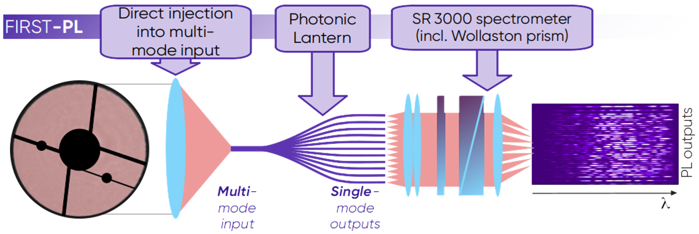

# Introduction

The FirstLP instrument is a photonic device operating at visible wavelengths, installed on the SCExAO instrument on the 8m SUBARU telescope (Hawaii).

The instrument is based on a 'photonic lantern' component. In simplified terms, it is an integrated field spectrograph, providing information on both the spatial and wavelength distribution of the astronomical source.

The advantages are twofold:  
1) It enables diffraction-limited imaging at visible wavelengths, with a spectral resolution of approximately 4000.  
2) It allows spectro-astrometric measurements below the diffraction limit of the telescope.

The main disadvantage is a very narrow field of view, which can be partially mitigated by moving the photonic lantern.

If your science case could benefit from these capabilities, read below...
