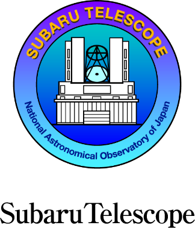
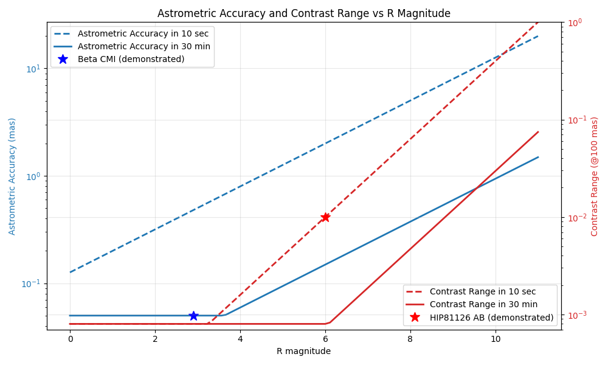

#  FIRST-PL
| University of Hawai'i | LIRA / Paris Observatory | Subaru Telescope |
|:---------------------:|:-----------------:|:----------------:|
|  |  |  |
### Fibered Imager foR a Single Telescope - Photonic Lantern
---

The FIRST-PL instrument is a photonic device operating at visible wavelengths, installed on the SCExAO instrument on the 8m SUBARU telescope (Hawaii).

The instrument is based on a 'photonic lantern' component. In simplified terms, it is an integrated field spectrograph, providing information on both the spatial and wavelength distribution of the astronomical source.

The advantages are twofold:  
1) It enables diffraction-limited imaging at visible wavelengths, with a spectral resolution of approximately 3000.  
2) It allows spectro-astrometric measurements below the diffraction limit of the telescope.

The main disadvantage is a very narrow field of view, which can be partially mitigated by moving the photonic lantern.

If your science case could benefit from these capabilities, read below...

Three modes are currently offered. In 30 minutes of observations, the following performances can be expected:

| Mode | Spectral Resolution | Bandwidth | Spatial/Astrometric Parameter | Field of View | Contrast | R mag (typical) |
|------|-------------------|-----------|------------------------------|---------------|----------|-------|
| **Spectro-astrometry** | 3000 | 630-780 nm | 100 µas (astrometric accuracy) | - | - | 4 mag |
| **Imaging on-axis** | Broadband | 630-780 nm | 20 mas (spatial resolution) | 130 mas | 10 | 11 mag |
| **High contrast off-axis imaging** | Broadband | 630-780 nm | 100 mas (inner working angle) | 1000 mas | 1000 | 6 mag |

Performance decreases for fainter targets. The plot below shows the achievable astrometric accuracy and contrast dynamic range as a function of R magnitude. These results are based on a combination of analytical models and empirical measurements:
