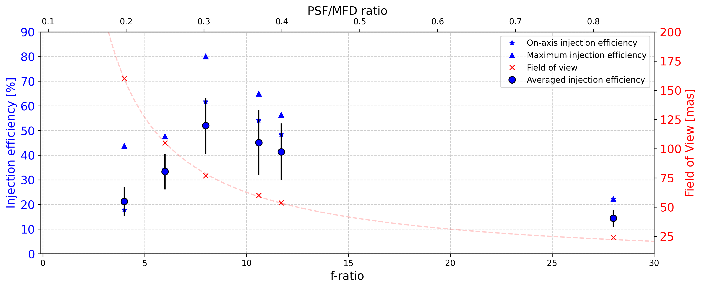
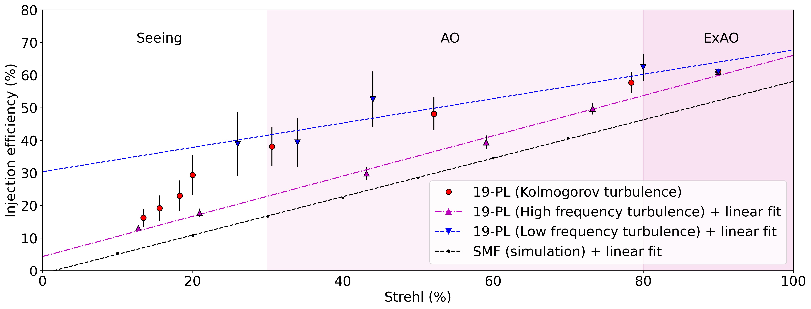

# Instrument performance

## Injection efficiency

### Injection efficiency versus focal ratio

Below graph shows the on-axis, maximum and average injection efficiency of the Photonic Lantern, at 642 nm, for various focal ratios. The measurements were performed on the bench without any turbulence. The estimated Strehl ratio at 750 nm (from VAMPIRES) was about 90%.

*Figure 3 : Variation of the injection effciency measured at 642 nm as a function of the focal ratio (bottom horizontal axis), or as a function of the ratio between the PSF size and MFD of the PL (top horizonal axis). For each focal ratio experimentally tested, we represent the on-axis injection efficiency, the maximum efficiency and the average over the whole scanned area. The field of view projected on-sky is also plotted with red crosses (right axis).*

The optimal injection efficiency was recorded for a focal ratio of 8. The current default setup of the Photonic Lantern injection module is f/8.

### Injection efficiency versus Strehl Ratio

To assess the injection efficiency into the PL in the presence of uncorrected atmospheric turbulence, turbulence is injected onto the SCExAO DM with various levels of upstream atmospheric turbulence correction. Turbulence screens are based on Kolmogorov spectrum with inner and outer scales, adopting the frozen flow approximation for temporal evolution, and are the closest to what we expect during on-sky observations. We fixed the wind speed at 10 m/s and modified the turbulence amplitude to vary the Strehl ratio. In order to study the behavior of the PL in various conditions, we varied the spatial frequency content of the simulated turbulence. We identified three distinct cases by adjusting the inner and outer scales of the turbulence:
- Turbulence following the Kolmogorov power spectrum (inner scale = 0.01 meter, outer scale = 20 meters), the closest to what we expect on-sky
- Turbulence dominated by high spatial frequencies (inner scale = 0.01 meter, outer scale = 1 meter), which would correspond to an ExAO case where low order aberrations are well corrected but there is still remaining high order aberrations (for example if the DM lacks actuators). 
- Turbulence dominated by the low spatial frequencies (inner scale = 10 meters, outer scale = 100 meters), which would correspond to a more classic AO loop performing poorly on low order aberrations (for example, during the observation of a faint star).

The injection module focal ratio was set to f/8. Results are shown on the below graph.

*Figure 4 : Relationship between the injection efficiency at 642 nm and the Strehl ratio measured at 750 nm for various atmospheric conditions. The turbulence is applied on the SCExAO DM and the flux is recorded at the 19-port PL output. The presented SMF results are simulations from Lin et al. (2021), where the simulated turbulence screens were following the Kolmogorov power spectrum.*