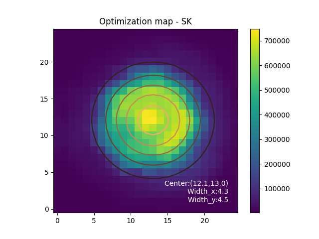
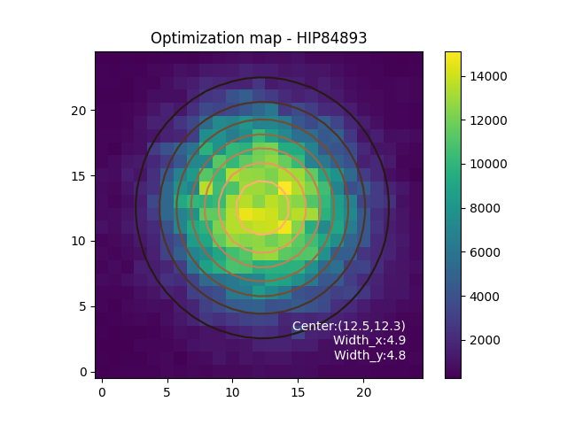

# Instrument setup

## Send light to the Photonic Lantern

On scexao2 computer, execute  
`first_pickoff in`

## Optimization procedure
### Start the process of flux recording
In  /home/first/src/firstctrl/FIRST_photom_control/ run :   
`python first_pl_flux.py`

### Take a dark

### Optimize the injection
In  /home/first/src/firstctrl/FIRST_photom_control/ run : 
`ipython`   
`run first_pl_optimization_injection_iocam.py` 
`pl_inj.optimization_raster(x0=98997,y0=173268,window_mas=1000, channel_opt=0, n_raw=10, npt=19,Target='Your_Target')`

|Injection optimization parameters||
|-|-|
| x0 | x coordinate of the center of the window scanned |
| y0 | y coordinate of the center of the window scanned |
|window_mas| size (in step) of the window scanned |
|n_raw| number of frames averaged per position |
|npt| number of samples per window side|
|Target| name of your target|

The coupling maps are saved in /home/first/Documents/FIRST-DATA/FIRST_PL/Optim_maps/
They should look like this : 

| On the bench          |  On-sky |
:-------------------------:|:-------------------------:
|   |   |

If the optimization is successful, the 2D gaussian fit will appear clearly on the coupling map image. If not, adjust the (x0,y0) corrdinates according to the coupling map shape (carreful, if the dark is bad, this process does not work properly).

