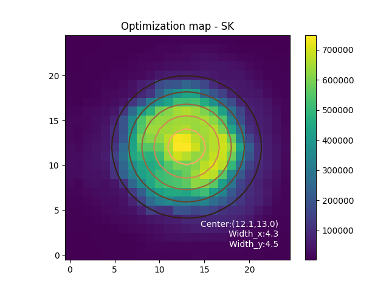
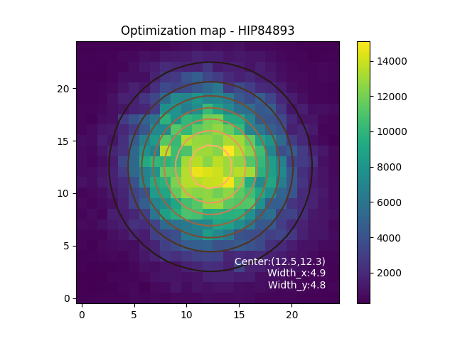

# Working with tmux shell (for remote control)

`tmux ls`                                 # list tmux sessions  
`tmux list-session`                       # list tmux sessions  
`tmux a -t {session-name}`                # open a tmux session   
`tmux new -s {session-name}`              # create a new tmux session with a new name   
`tmux rename -t {old-name} {new-name}`    # rename an existing session  

# Pre-requisites (stuff that must be done)

## 0. AFTER EACH COMPUTER REBOOT, RUN :

########## VERY IMPORTANT : 
`cc-rightafterreboot`

# Starting scripts (stuff that must be running but shall be started only once)

## 1. starting the tip-tilt listener

`tmux a -t firstpl_tt_listener`
puis:
`firstpl_tt_listener`

## 2. start LP control

`tmux a -t fircam_ctrl`  
`firstpl_controller_start`  

cam ==> camera  
ld ==> lantern driver (low level)  
scripts ==> lantern driver (intermediate level, scripts only for electronics)  
pls ==> photonic lantern scripts (high level)  

# real time displays

## 1. start camera viewer

`firstcam -z 2 &`                           # Start the camera viewer  

### 2. Display live reconstruction

`firstpl_rtd_start`			# Start and load the SHM. Use rtd.vmax and rtd.vmin to control color scale on the display.  
`firstpl_rtd_show`			# Display the live  

# Starting scripts (stuff that must be running but shall be started at the beginning of the night)

## 1. startup electronics 

`pls.bon.startup_electronics()`		# To launch in python, Restart the electronic  

## 1. fitslogger 

Start fits logger communication procedure, in basic terminal:  
`FPS_FILTSTRING_NAME="FITS" milk-fpsCTRL -f /milk/shm/milkfifologger`

In case the fitslogger does not work properly, you should run this command. That will reset the fitslogger :  
`pls.bon.startup_fitslogger()`		# To launch in python, Restart the fits logger  

## 2. fusion of fits with modulation pattern:

To merge the FITS files to include the modulation pattern (otherwise, it will be missing):

`tmux a -t firstpl_fitsmerger`  
and
`firstpl_fitsmerger`  

It must be run AFTER the `startup_fitslogger` command, since it requires parameters (including the name of the directory where the files are stored)  

# Instrument setup

## Send light to the Photonic Lantern

### 1. Pick off mirror
On scexao2 computer, to know the status of the pick off mirror:  
`first_pickoff status`

To put the pick off mirror in:  
`first_pickoff in`

To put the pick off mirror out:  
`first_pickoff out`
also on the scexao2 computer

### 2. Starting the supercontinuum source (for calibration)

On scexao@scexso2 computer,   
`superk power on`

Changing the intensity, 
`src_flux waymore`
`src_flux wayless`

### 3. flattening the DM (in case of issue)

On scexao@scexao6 computer,   
`dmflat`

To center the PSF of PALILA, use ctrl+arrows.

## Getting photons on the detector

### 0. zaber to default position

first_pl_inj x status...
first_pl_inj x goto 98500 ...
first_pl_inj y goto 166500 ...

### arreter modulation du piezo

ld.switch_modulation_loop(Flase)
ld.move_piezo(0,0)

facteur 10 a peu pres enctre unite de contrainte des piezo et unite du zaber

### 1. command to the camera

cam.get_tint

### 2. scan with the tip-tilt

mod squence:
number 1 : 1 (fixed position at zero)
number 2 : 150 hexagonal (diam =16)
number 3 : 595 hexagonal (diam = 31)
number 4 : 144 rectangular (length = 12)
number 5 : 625 axis (length = 25)

mod_scale : taille de la modulation (lantern va de -25 a +25 en unite de contraite).
mod_scale pour avoir tout la lanterne : 30, echantillone a 16.
mod_scale pour avoir tout le piezo : 1000, en utilisant number 5 (length = 25).

A peu pres 1 mas par unite de jauge de contrainte.

objX, objY :  autour du zero du tip-tilt. Pas forcement le centre de la photonic lantern.

Acquerir un cube:

nimages, nombre de dit, doit etre un facteur de la longeur de la sequence.
ncubes, 

`pls.acq.get_images(nimages, ncubes, mod_sequence, mod_scale, tint, objX, objY)` # Take fits following a mod pattern  
`pls.ins.opti_flux()`			# Display flux from most recent fits file saved  

## End of the night calibration

pls.eon == > to be done...

## Old zaber positionning (moving the photonic lantern itself)

### 2. Optimization
In  /home/first/src/firstctrl/FIRST_photom_control/ run : 
`ipython`   
`run first_pl_optimization_injection_iocam.py` 
And then : 
`pl_inj.whatyouwant`   

#### 2.1 Take a dark
`pl_inj.acq_dark()`  
- Option :
    - `vis_block = True/False` (adding the vis block in/out during dark measurement - check with VAMPIRES instrument when using this block)

#### 2.2 Optimize the injection
`pl_inj.optimization_raster(x0=98997,y0=173268,window_step=1000, channel_opt=0, n_raw=10, npt=19,Target='Your_Target')`  

|Injection optimization parameters||
|-|-|
| x0 | x coordinate of the center of the window scanned |
| y0 | y coordinate of the center of the window scanned |
|window_step| size (in step) of the window scanned |
|n_raw| number of frames averaged per position |
|npt| number of samples per window side|
|Target| name of your target|

The coupling maps are saved in /home/first/Documents/FIRST-DATA/FIRST_PL/Optim_maps/
They should look like this : 

| On the bench          |  On-sky |
:-------------------------:|:-------------------------:
|   |   |

If the optimization is successful, the 2D gaussian fit will appear clearly on the coupling map image. If not, adjust the (x0,y0) corrdinates according to the coupling map shape (carreful, if the dark is bad, this process does not work properly).

## running the software to control the photonic lantern

### 1. camera control 

tmux a -t   

pls.acq.get_images(nimages={nb_pts}, ncubes, mod_sequence={mod_id}, mod_scale={size}, tint) # Take fits following a mod pattern  
pls.ins.opti_flux()			# Display flux from most recent fits file saved  

### 2. Modulation 

scripts.upload_modulation_sequence(num_id, *pls.mod.{mode}())  
xmod, ymod = scripts.retrieve_modulation_sequence(num_id)  

### 3. fitsLogger

pls.bon.startup_fitslogger()		# To launch in python, Restart the fits logger  

# Additional how-to

############ Start Binning  

~/src/firstctrl/FIRST_photom_control/    # Code location  
run first_pl_crop.py                     # run the code containing the bin function  
pl_b = firstpl_crop()                    # Initialize stuff  
pl_b.run_binning(N=12)                   # run binning = 12  

first_tcp                                                    # tmux session for the UDP trnasfer   
milk-nettransmit 30201 -T 10.20.30.6 -s firstpl_bin -U       # start the UDP trasnfer  

# SHM control

## SHM Stream control 

milk-streamCTRL                                                     # Shows the various shared memories running (or not :p) 

milk-streamFITSlog -d "/mnt/datazpool/PL/" -z 1000 firstpl pstart   # Start the saving process for the firstpl shm with a default of 1000 im per cube in the specifi
ed directry
FPS_FILTSTRING_NAME="FITS" milk-fpsCTR                              # Open the Fits logger
 - In the fitslogger :
    Shift+r : start the process
    Ctrl+r : stop the process
    Ctrl+e : kill the process 

milk-streamFITSlog -z {nimages} -c {ncubes} {shm_name} on           # Starts saving shm_name for ncubes of nimages  

## Create a new SHM (python code)
map_void          = np.zeros(({width}, {height}), dtype=np.float32)  
{shm_var}         = shm('{shm_name}', map_void, location=-1, shared=1)  
{shm_var}.set_data({image})   

camstart first                          # Starts the FIRST-PL Hamamatsu camera   , old technique

### 1. Start the process of flux recording
In  /home/first/src/firstctrl/FIRST_photom_control/ run :   
`python first_pl_flux.py`
????? old stuff from seb