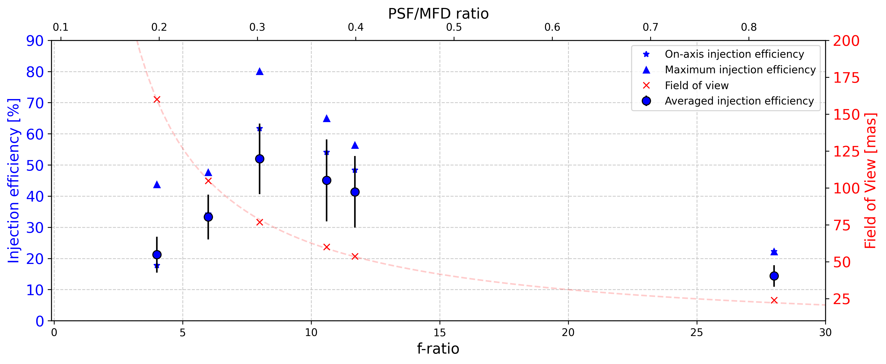
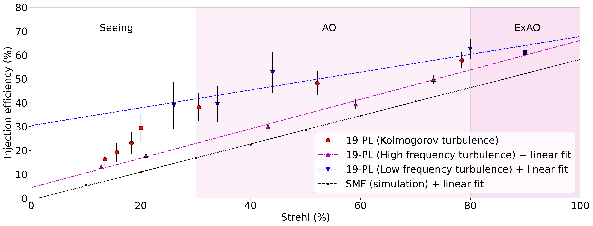

# Troubleshooting

## Camera frozen

If the camera viewer freezes, you can first check whether it is running or not by :  <br />
- Check the streams activity using `milk-streamCTRL`
- Checkng the `firstpl_fgrab` tmux session.

If both show that the camera is not running, try restarting the control software `firstpl_controller_start`. <br />

If the camera is still not running, powercycle it. From a scexao2 termnial, power cycle issuing the following : <br />
`nps 2 7 off` (wait a few seconds)
`nps 2 7 on`

Wait a few seconds, and restart the control software `firstpl_controller_start`.


# Additional how-to

## SHM Stream control 

milk-streamCTRL                                                     # Shows the various shared memories running (or not :p) 

milk-streamFITSlog -d "/mnt/datazpool/PL/" -z 1000 firstpl pstart   # Start the saving process for the firstpl shm with a default of 1000 im per cube in the specifi
ed directry
FPS_FILTSTRING_NAME="FITS" milk-fpsCTR                              # Open the Fits logger
 - In the fitslogger :
    Shift+r : start the process
    Ctrl+r : stop the process
    Ctrl+e : kill the process 

milk-streamFITSlog -z {nimages} -c {ncubes} {shm_name} on           # Starts saving shm_name for ncubes of nimages  


## Create a new SHM (python code)
map_void          = np.zeros(({width}, {height}), dtype=np.float32) <br />
{shm_var}         = shm('{shm_name}', map_void, location=-1, shared=1) <br />
{shm_var}.set_data({image})  <br />


## Old way to start the camera
camstart first                          # Starts the FIRST-PL Hamamatsu camera  <br />

## Start the focal plane camera

Start the focal plane camera using `camstart first_pupil`.  <br />
Start the viewer with `shmImshow.py fpupcam` (temprorary viewer). 
Insert the pickoff using `firstpl_fp`


## Manually changing data type
In a terminal, execute the command line `first_datatype DATA_TYPE`,
with DATA_TYPE being one of the following list:
- "ACQUISITION"
- "BIAS"
- "COMPARISON"
- "DARK"
- "DOMEFLAT"
- "FLAT"
- "FOCUSING"
- "OBJECT"
- "SKYFLAT"
- "STANDARD"
- "TEST"


# Old optimization procedure (using Zabers)

The Zaber motors move the lantern physically in the focal plane 

Commands to check and set the Zaber position:
```
first_pl_inj x status
first_pl_inj x goto 98500
first_pl_inj y goto 166500
```

### 1. Start the process of flux recording
In  /home/first/src/firstctrl/FIRST_photom_control/ run :  <br />
`python first_pl_flux.py`

### 2. Optimization
In  /home/first/src/firstctrl/FIRST_photom_control/ run :<br />
`ipython`  <br />
`run first_pl_optimization_injection_iocam.py`<br />
And then :<br />
`pl_inj.whatyouwant`  <br />

#### 2.1 Take a dark
`pl_inj.acq_dark()`
- Option :
    - `vis_block = True/False` (adding the vis block in/out during dark measurement - check with VAMPIRES instrument when using this block)

#### 2.2 Optimize the injection
`pl_inj.optimization_raster(x0=98997,y0=173268,window_step=1000, channel_opt=0, n_raw=10, npt=19,Target='Your_Target')`

|Injection optimization parameters||
|-|-|
| x0 | x coordinate of the center of the window scanned |
| y0 | y coordinate of the center of the window scanned |
|window_step| size (in step) of the window scanned |
|n_raw| number of frames averaged per position |
|npt| number of samples per window side|
|Target| name of your target|

The coupling maps are saved in /home/first/Documents/FIRST-DATA/FIRST_PL/Optim_maps/
They should look like this : 

| On the bench          |  On-sky |
:-------------------------:|:-------------------------:
|   |   |

If the optimization is successful, the 2D gaussian fit will appear clearly on the coupling map image. If not, adjust the (x0,y0) corrdinates according to the coupling map shape (carreful, if the dark is bad, this process does not work properly).


# Lab performances

## Injection efficiency

### Injection efficiency versus focal ratio

Below graph shows the on-axis, maximum and average injection efficiency of the Photonic Lantern, at 642 nm, for various focal ratios. The measurements were performed on the bench without any turbulence. The estimated Strehl ratio at 750 nm (from VAMPIRES) was about 90%.



*Figure 3 : Variation of the injection effciency measured at 642 nm as a function of the focal ratio (bottom horizontal axis), or as a function of the ratio between the PSF size and MFD of the PL (top horizonal axis). For each focal ratio experimentally tested, we represent the on-axis injection efficiency, the maximum efficiency and the average over the whole scanned area. The field of view projected on-sky is also plotted with red crosses (right axis).*

The optimal injection efficiency was recorded for a focal ratio of 8. The current default setup of the Photonic Lantern injection module is f/8.

### Injection efficiency versus Strehl Ratio

To assess the injection efficiency into the PL in the presence of uncorrected atmospheric turbulence, turbulence is injected onto the SCExAO DM with various levels of upstream atmospheric turbulence correction. Turbulence screens are based on Kolmogorov spectrum with inner and outer scales, adopting the frozen flow approximation for temporal evolution, and are the closest to what we expect during on-sky observations. We fixed the wind speed at 10 m/s and modified the turbulence amplitude to vary the Strehl ratio. In order to study the behavior of the PL in various conditions, we varied the spatial frequency content of the simulated turbulence. We identified three distinct cases by adjusting the inner and outer scales of the turbulence:
- Turbulence following the Kolmogorov power spectrum (inner scale = 0.01 meter, outer scale = 20 meters), the closest to what we expect on-sky
- Turbulence dominated by high spatial frequencies (inner scale = 0.01 meter, outer scale = 1 meter), which would correspond to an ExAO case where low order aberrations are well corrected but there is still remaining high order aberrations (for example if the DM lacks actuators). 
- Turbulence dominated by the low spatial frequencies (inner scale = 10 meters, outer scale = 100 meters), which would correspond to a more classic AO loop performing poorly on low order aberrations (for example, during the observation of a faint star).

The injection module focal ratio was set to f/8. Results are shown on the below graph.



*Figure 4 : Relationship between the injection efficiency at 642 nm and the Strehl ratio measured at 750 nm for various atmospheric conditions. The turbulence is applied on the SCExAO DM and the flux is recorded at the 19-port PL output. The presented SMF results are simulations from Lin et al. (2021), where the simulated turbulence screens were following the Kolmogorov power spectrum.*


# FIRST-PL Team


The project is the result of a collaboration between the University of Hawai'i, the Paris Observatory, and the Subaru Telescope. The team is responsible for ensuring that the instrument remains in good condition and fully operational for observations. The team will also help with data reduction and maintain a working pipeline. It is currently composed of:

| Role | Name | Institut |
|------|------|----------|
| PI | S. Vievard | U. of Hawaii |
| PI | E. Huby | Paris Observatory |
| AO scientist | O. Guyon | SUBARU telescope |
| Instrument scientist | S. Lacour | Paris Observatory |
| System scientist | M. Nowak | Paris Observatory |
| Spectrometer | M. Lallement | IPAG / CNRS |
| Electronics | T. Lemoult | Paris Observatory |
| Data reduction & Software | A. Walk | U. of Hawaii |
| Data reduction & Software  | Y. J. Kim | UCLA |
| Data reduction & Software  | J. Sarrazin | Paris Observatory |

| University of Hawai'i | LIRA / Paris Observatory | Subaru Telescope |
|:---------------------:|:-----------------:|:----------------:|
|  |  |  |

