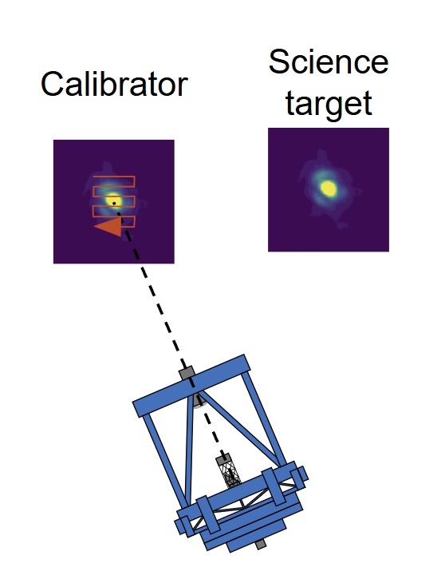
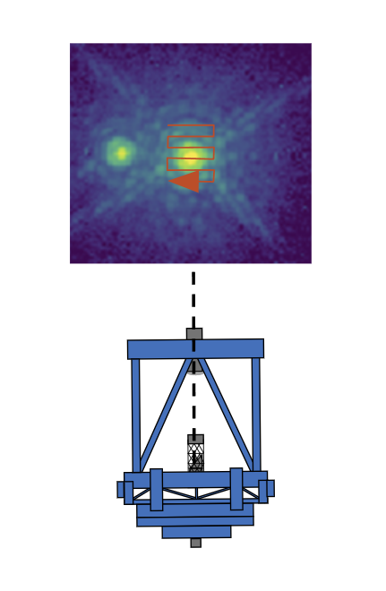
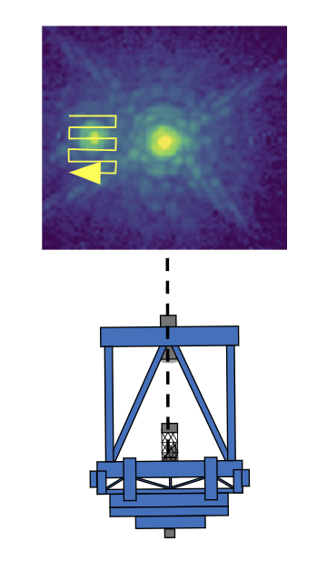

# Observing procedure

Choose the [observing mode](#instrument_principle) corresponding to your science case.

Follow these observing sequences:

## Spectro-astrometry

Record the Photonic Lantern data ***AND*** either the Visible ***or*** IR focal plane.


## On-axis image reconstruction

**In this mode, the calibrator is a different star from the sceince target** <br>

***Choice of calibrator:*** At least as bright as the sceince target

**Observation procedure:**

1. Point the telescope to the calibrator
2. Acquire data while modulating the tip/tilt mirror
```{image} 1_obs.png
:width: 50 px
```

3. Point the telescope to the science target
4. Acquire data while modulating the tip/tilt mirror


*Overheads for calibrator :* Setup field + setup AO + acquisition


## Off-axis image reconstruction

**In this mode, the calibrator is the central star, science target is off-axis** <br>

***Choice of calibrator:*** Central star

**Observation procedure:**

1. Point the telescope to the target
2. Acquire data while modulating the tip/tilt mirror on the central star

3. Acquire data while modulating the tip/tilt with an offset on the science target. *Note:  the offset is done by the tip/ilt mirror*


*Overheads for calibrator :* enter the command for offset in the instrument control
