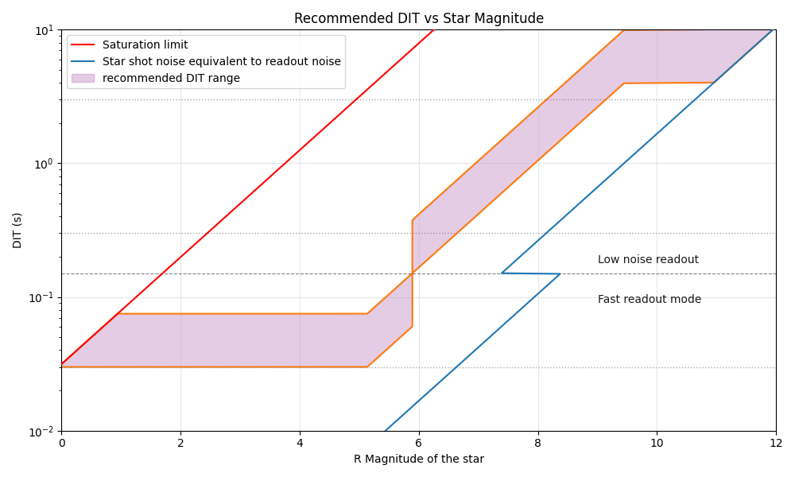

# Acquiring data

## Using wollaston or not

The command to move the wollaston in/out is :
`first_pl_wollaston in/out`
in the shell

## Rolling vs Triggered mode

The lantern can be operated in two distinct modes: rolling and triggered. Data are acquired differently in these two modes.

1. Rolling mode: the camera is triggered internally and nevers stops. The electronics sets the tip/tilt to a fixed position. Data are acquired using the fitslogger manually.
2. Triggered mode: the camera is set to external trigger, and the electronics controls the tip/tilt to move the target at each new frame acquired by the camera. Data should only be acquired using the dedicated methods in the control terminal, and not by direct interaction with the fits logger.  

To change the parameters on the camera:
- Change exposure time : `cam.set_tint()`
- Check exposure time : `cam.get_tint()`
- Change readout mode : `cam.set_readout_mode()` 
    - Options:
        - 'FAST' : < 150 ms
        - 'SLOW' : > 150 ms
- Change crop size : `cam.set_camera_mode`
    - Options:
        - 'FIRSTPL' : For the regular Photonic Lantern mode
        - 'FIRSTPLWFS' : For the Wavefront sensing mode
        - 'FIRSTPLSMF' : For imaging of the SMF
        - 'FULL' : Full frame


## Getting data in rolling mode

The rolling mode is activated using the following method:
```
pls.acq.set_mode_rolling(x = 0, y = 0, open_loop = True)
```
The `x` and `y` coordinates correspond to the location of the tip/tilt. Most of the time, this should be set to 0 to keep the alignement performed with the zabers. The `open_loop` parameter determines whether the electronics actively controls the tip/tilt to stay centered on 0 (i.e. "closed loop" regime, or `open_loop = True`), or completely deactivates the control loop (`open_loop = True`). 

Once the rolling mode is active, data can be acquired by setting up the fitslogger manually. 

## Getting data in triggered mode

To put the system in triggered mode, run:
```
pls.acq.set_mode_triggered()
```

Once the system is in triggered mode, data should be acquired only using the dedicated command:
```
pls.acq.get_images(nimages = 595, ncubes = 1, tint = 0.1, mod_sequence = 3, mod_scale = 30, objX = 0 , objY = 0)
```
The parameters are as follows:
- `nimages`: Number of DITs (ideally should be a factor of the sequence length)
- `ncubes`: Number of cubes to acquire
- `tint`: Integration time of the camera
- `mod_sequence`: See numbers above (must be between 1 and 7)
- `mod_scale`: the radius of the modulation pattern (in mas)

The modulation patterns are defined from -1 to 1 mas and scaled using the `mod_scale` parameter. There are currently 7 patterns implemented:
- **Number 1**: Fixed position at zero
- **Number 2**: 150 points hexagonal
- **Number 3**: 595 points hexagonal
- **Number 4**: 144 points rectangular
- **Number 5**: 625 points rectangular
- **Number 6**: 313 points hexagonal
- **Number 7**: 19 points hexagonal

Modulation scale:
- **Lantern modulation**: Scale = 30, sampled at 16 units
- **Piezo modulation**: Scale = 1000, using sequence number 5 (length = 25)


## Setting the best exposure time

The integration time should be chosen so that we are not limited by readout noise, while keeping the integration time as short as possible. The integration time must also account for the fact that the piezo tip-tilt has a limited bandwidth of approximately 100Hz.

The easiest way is to select the detector integration time (DIT) according to the plot below:


