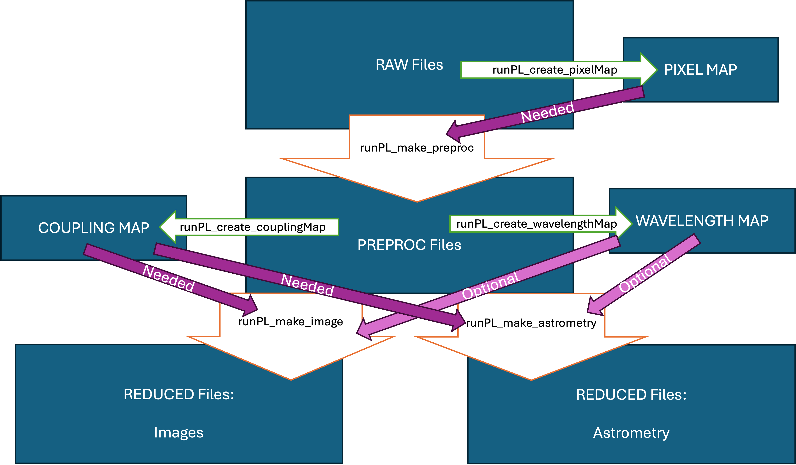

# Data organisation

The "runPL_*.py" scripts are designed to run sequentially, each handling a specific stage of data reduction, calibration, and analysis. 

Two main FITS file keywords are used to organise the data: "DATA-TYP" and "X_FIRTYP". The first keyword is specific to SUBARU, the second one is specific to the FIRST instrument.

The user will give the files as arguments to each script. If no argument is given, the script will look for all files within the current directory. The script will automatically select relevant data based on the FITS keywords.

 

# Pipeline Structure

## Directory Organization
```
first_pipeline/
├── classes/          # Data structure classes
│   ├── runPL_class_pixelMap.py
│   ├── runPL_class_dataCube.py
│   ├── runPL_class_flatMap.py
│   ├── runPL_class_waveMap.py
│   └── runPL_class_couplingMap.py
├── libraries/        # Utility functions
│   ├── runPL_library_basic.py
│   ├── runPL_library_io.py
│   ├── runPL_library_linalg.py
│   └── runPL_library_plots.py
├── [main scripts]    # Primary pipeline scripts
├── runPL_create_pixelMap.py
├── runPL_make_preproc.py
├── runPL_create_flatMap.py
├── runPL_create_waveMap.py
├── runPL_create_couplingMap.py
├── runPL_make_image.py
└── runPL_make_astrometry.py
```

## Workflow

1. **Inspect FITS files**: `./runPL_dfits <file>`
2. **Update keywords if needed**: `python runPL_changeKeyword.py --X_FIRTYP=RAW *.fits`
3. **Create pixel map**: `python runPL_create_pixelMap.py --filter_files *.fits`
4. **Preprocess data**: `python runPL_make_preproc.py /data/directory`
5. **Create flat field map**: `python runPL_create_flatMap.py *.fits`
6. **Generate wavelength map**: `python runPL_create_waveMap.py *.fits`
7. **Create coupling maps**: `python runPL_create_couplingMap.py *.fits`
8. **Perform astrometry if needed**: `python runPL_make_astrometry.py *.fits`
9. **Reconstruct images if needed**: `python runPL_make_image.py *.fits`

## Key Components
- **Shell and Python scripts**: Each major step is a separate script
- **Data flow**: Raw FITS files → Pixel Map → Preprocessing → Wavelength Map → Coupling Maps → Calibration → Image Reconstruction
- **Script chaining**: Output from one script is often input for the next
- **Modern CLI**: All scripts use `argparse` for professional command-line interfaces

## Requirements

- **Python dependencies**: 
  - Core scientific stack: `numpy`, `scipy`, `matplotlib`
  - Astronomy libraries: `astropy`, `astroplan` 
  - Utility libraries: `tqdm` (progress bars), `peakutils` (peak detection)
- **External tools**: `dfits` from ESO FITS Tools for FITS inspection
- **FITS keywords**: Scripts rely on specific header keywords for file selection
