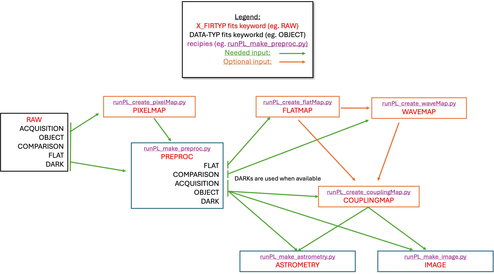

# Data organisation

Two main FITS file keywords are used to organise the data: "DATA-TYP" and "X_FIRTYP". The first keyword is specific to SUBARU, the second one is specific to the FIRST instrument.

The "runPL_*.py" scripts are designed to run sequentially, each handling a specific stage of data reduction, calibration, and analysis. 

The user will give the files as arguments to each script. If no argument is given, the script will look for all files within the current directory. The script will automatically select relevant data based on the FITS keywords.



> **Note**: For the most up-to-date information, see the [official README](https://github.com/scexao-org/first_pipeline/blob/main/README.md) in the repository.


# Installation

1. **Clone the repository:**
   ```bash
   git clone https://github.com/scexao-org/first_pipeline.git
   cd first_pipeline
   ```

2. **Install the package in development mode:**
   ```bash
   pip install -e .
   ```
   
3. **Install ESO FITS Tools (required for `runPL_dfits`):**
   ```bash
   # On macOS with Homebrew:
   brew install cfitsio
   
   # Or install from source:
   # See: https://github.com/granttremblay/eso_fits_tools
   ```

4. **Verify installation:**
   ```bash
   runPL_changeKeyword --help
   runPL_create_pixelMap --help
   # All runPL_* commands should work from any directory
   ```

**Note**: Installed commands can be run from any directory as `runPL_changeKeyword`, `runPL_create_pixelMap`, etc.

# Pipeline Structure

## Directory Organization

The pipeline uses a modular structure where each script is organized as its own subpackage under a `src/` layout with **core algorithms separated from CLI interfaces**. This enables both command-line usage and interactive development in VS Code, Jupyter notebooks, or Python REPL.

```
first_pipeline/
├── README.md                     # This documentation
├── setup.py                      # Package setup and installation  
├── requirements.txt              # Python dependencies
├── runPL_dfits                   # FITS inspection shell script
└── src/                          # Source code directory (src layout)
    ├── first_pipeline_shared/    # Shared components across all modules
    │   ├── __init__.py
    │   ├── classes/              # Data structure classes
    │   │   ├── __init__.py
    │   │   ├── runPL_class_couplingMap.py
    │   │   ├── runPL_class_dataCube.py
    │   │   ├── runPL_class_pixelMap.py
    │   │   ├── runPL_class_flatMap.py
    │   │   ├── runPL_class_waveMap.py
    │   │   └── runPL_class_preproc.py
    │   └── libraries/            # Utility functions
    │       ├── __init__.py
    │       ├── runPL_library_io.py
    │       ├── runPL_library_linalg.py
    │       └── runPL_library_plots.py
    ├── changeKeyword/            # FITS keyword modification module
    │   ├── __init__.py
    │   ├── main.py              # CLI interface with argparse
    │   └── run_changeKeyword.py # Core algorithms & development defaults
    ├── createPixelMap/           # Pixel mapping module
    │   ├── __init__.py
    │   ├── main.py              # CLI interface with argparse
    │   └── run_createPixelMap.py # Core algorithms & development defaults
    ├── makePreproc/              # Data preprocessing module
    │   ├── __init__.py
    │   ├── main.py              # CLI interface with argparse
    │   └── run_makePreproc.py   # Core algorithms & development defaults
    ├── createFlatMap/            # Flat field mapping module
    │   ├── __init__.py
    │   ├── main.py              # CLI interface with argparse
    │   └── run_createFlatMap.py # Core algorithms & development defaults
    ├── createWaveMap/            # Wavelength mapping module
    │   ├── __init__.py
    │   ├── main.py              # CLI interface with argparse
    │   └── run_createWaveMap.py # Core algorithms & development defaults
    ├── createCouplingMap/        # Coupling efficiency mapping module
    │   ├── __init__.py
    │   ├── main.py              # CLI interface with argparse
    │   └── run_createCouplingMap.py # Core algorithms & development defaults
    ├── makeImage/                # Image reconstruction module
    │   ├── __init__.py
    │   ├── main.py              # CLI interface with argparse
    │   └── run_makeImage.py     # Core algorithms & development defaults
    └── makeAstrometry/           # Astrometric processing module
        ├── __init__.py
        ├── main.py              # CLI interface with argparse
        └── run_makeAstrometry.py # Core algorithms & development defaults
```

## Workflow

1. **Inspect FITS files**: `runPL_dfits <file>`
2. **Update keywords if needed**: `runPL_changeKeyword.py --X_FIRTYP=RAW *.fits`
3. **Create pixel map**: `runPL_create_pixelMap.py --filter_files *.fits`
4. **Preprocess data**: `runPL_make_preproc.py /data/directory`
5. **Create flat field map**: `runPL_create_flatMap.py *.fits`
6. **Generate wavelength map**: `runPL_create_waveMap.py *.fits`
7. **Create coupling maps**: `runPL_create_couplingMap.py *.fits`
8. **Perform astrometry if needed**: `runPL_make_astrometry.py *.fits`
9. **Reconstruct images if needed**: `runPL_make_image.py *.fits`

## Key Components
- **Shell and Python scripts**: Each major step is a separate script
- **Data flow**: Raw FITS files → Pixel Map → Preprocessing → Wavelength Map → Coupling Maps → Calibration → Image Reconstruction
- **Script chaining**: Output from one script is often input for the next
- **Modern CLI**: All scripts use `argparse` for professional command-line interfaces

## Requirements

- **Python dependencies**: 
  - Core scientific stack: `numpy`, `scipy`, `matplotlib`
  - Astronomy libraries: `astropy`, `astroplan` 
  - Utility libraries: `tqdm` (progress bars)
- **External tools**: `dfits` from ESO FITS Tools for FITS inspection
- **FITS keywords**: Scripts rely on specific header keywords for file selection
