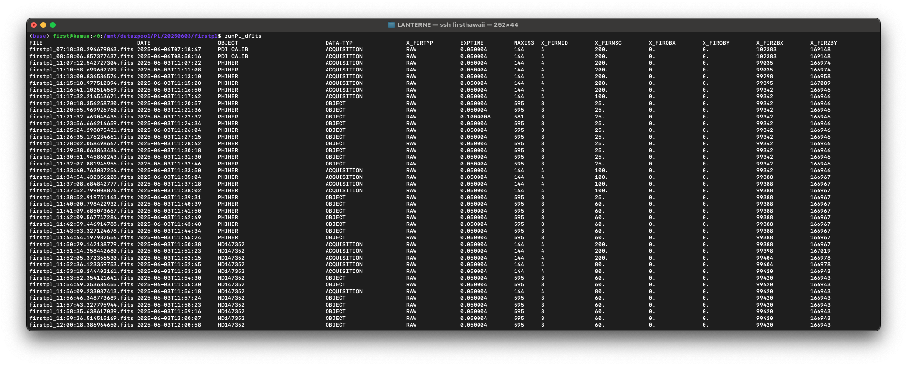

# Utility tools

## tmux note

If you are processing the data directly on the first machine (kamua), we recommand using tmux:
`tmux new -s first_pipeline`
or if it already exists: 
`tmux a -t first_pipeline`

## $DETDATA alias

You can go to the data directory directly with the command `cd $DETDATA`

## runLP_dfits

It shows the most important parameters of header:


Note that it needs dfits to be installed. It can be found there:
https://github.com/granttremblay/eso_fits_tools


## runPL_changeKeyword.py

change the important DPR keywords of files (for exemple, to mark a DARK if not properly taged).

This is, for example, useful when we are changing the Wollaston and the keywords are not properly set. In that case, a typical use would be:
```
runPL_changeKeyword.py firstpl_08:03:23.046790629.fits firstpl_08:05:07.698580687.fits -w OUT
```
check `runPL_changeKeyword.py --help` to see which keywords can be changed


## download all preproc data to the gravity machine

run `sh_copydatatoGravity.sh` in the tmux terminal and go have some sleep
