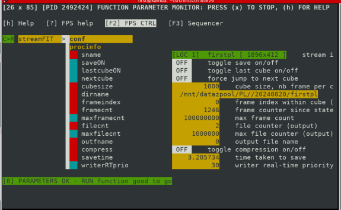

# Save data

We use the logshim tool in order to log FIRST data. To setup the saving, type in a terminal :   
`milk-streamFITSlog -d "/mnt/datazpool/PL/" -z 1000 firstpl pstart`

Then, open the GUI :  
`FPS_FILTSTRING_NAME="FITS" milk-fpsCTRL`

The GUI looks like this:

To start the process : Shift+r  
To stop the process : Ctrl+r   